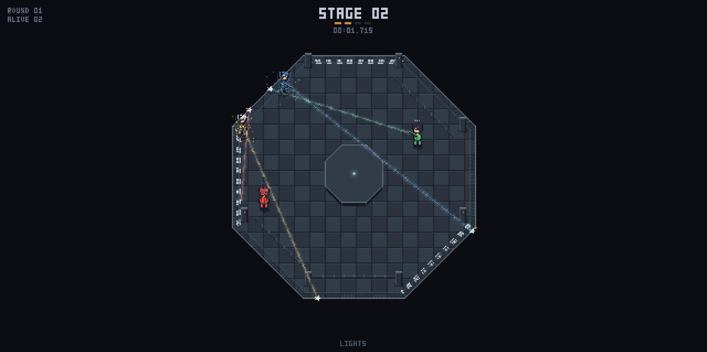
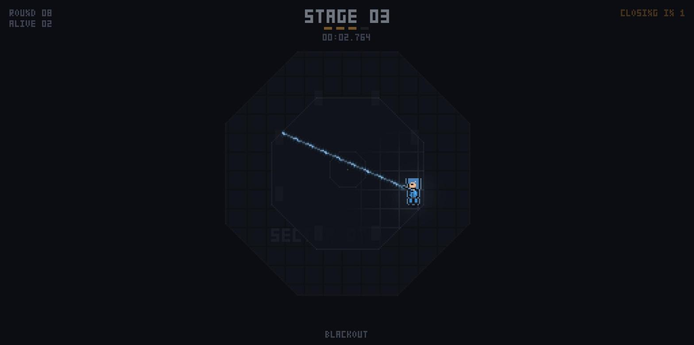
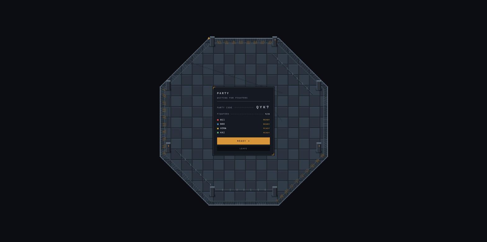
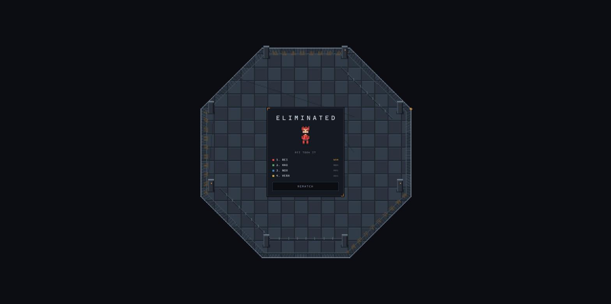

# DeadLight

A multiplayer game about shooting at a memory.

The lights come on and you see everyone. Then the arena goes dark. For the next
few seconds you can see nothing but your own fighter and your own laser, and
neither can anyone else — so you run somewhere new while aiming at where you
think someone else is running to. The lights come back, every beam is drawn at
once, and whoever guessed right is still standing.

Two to six players. One pistol. No abilities, no upgrades, no loadouts.


## The round

| Beat | Length | |
| --- | --- | --- |
| Lights on | 1.4s | Everyone and every beam is visible. Hits resolve. Movement is locked. |
| Blackout | 2.4–3.0s | You see only yourself. Move with `WASD`, aim with the mouse. |
| Warning flicker | from 1.9s | The room pulses twice. The lights are about to return. |

Rounds take under four seconds. Relocation is unrestricted: move speed and
blackout length are set so that one blackout covers the full width of a
stage-one arena, which means wherever you were last seen, you can be anywhere
when the lights return.

Three rules carry the whole game:

**Beams pierce.** A laser hits every player it crosses, so lining two people up
on one axis kills both.

**Mutual hits cancel.** If two players hit each other, that pair neutralises and
both survive — but either beam still kills anyone else it crossed. Cancellation
is pairwise, not whole-beam.

**The arena shrinks four times, through five stages.** Once when players are eliminated, and once
whenever three rounds pass with nobody dying. The second trigger is what stops a
cagey endgame from stalling, and it is the only reason a two-player match ever
reaches the last stage.

The lights return at a random moment inside a 600ms window, so the flicker warns
you that time is nearly up without ever telling you exactly when.

## Art direction

A decommissioned test facility, not a neon grid. Steel and concrete carry the
room; amber is reserved for warnings; saturated colour belongs only to the
fighters and their beams, so the eye always finds the things that can kill you.

The floor is plated with seamed panels. Eight columns stand at the perimeter,
drawn with a few pixels of real height so the room has depth. Conduit runs hug
the wall between them — deliberately never crossing the open floor, where a
straight line gets mistaken for someone's aim. Hazard chevrons are painted on
three walls, not eight, because a symmetrical ring reads as decoration.


The blackout is a separate visual state, not a dark layer over the lit scene.
The panel pattern, the platform, the markings are simply not drawn. What remains
is your fighter under a rim light, your laser, your own lamp picking out the
seams within a few metres, and the dead structure as silhouettes.



When the lights return the beams do not just appear: there is a flash, then each
beam grows out of its muzzle while flickering, stabilises, and lands on the wall
with sparks, an expanding ring and a glow mark that lingers. Hits apply 250ms
later, so you get to read the line that killed you before you drop. Eliminated
fighters dissolve pixel by pixel and leave a coloured outline behind.



The arena's original footprint never leaves the screen — it stays as a
powered-down husk, so a shrink reads as floor being switched off rather than the
world ending. Before the wall moves, the doomed ring flashes its hazard paint;
then the boundary slides inward and locks, and the HUD calls it out with
`PLATFORM SHRINKING` for as long as it is happening.

The HUD has one timer with one meaning: `LIGHTS OUT 1.24`, counting down while
the lights are on. Nothing is shown during a blackout, because when the lights
come back is the one thing nobody is allowed to know.

### How the pixels are drawn

Everything in the world is rendered into a **software framebuffer** — a plain
`Uint8ClampedArray` the game writes pixel by pixel — then blitted to the canvas
at an integer scale with nearest-neighbour filtering.

That is the reason the art holds together. Canvas strokes anti-alias, and
anti-aliased pixel art is just blurry art. Owning the pixels means every panel
seam, laser and sprite lands exactly on the grid, additive glow is a real
operation rather than a shadow hack, and the death dissolve can address
individual pixels. One buffer pixel is a fixed number of arena units, so a
fighter is the same size in art pixels in every match.

Fighters are composited at runtime from layered character-string grids — body,
legs, hair — in `client/sprites.ts`, validated on load so a mistyped row fails
loudly instead of rendering a hole. The head is six pixels of face with hair
framing it from outside; hair drawn across the face just reads as a helmet. Each
colour slot owns a hairstyle and palette, so a player's colour always reads as
the same character. Arm and gun are rasterised along the aim vector rather than
rotated, because at this size rotation smears pixels and the barrel has to point
exactly where the beam goes.

The HUD uses a 3×5 bitmap face authored as rows in `client/font.ts`, drawn into
the same buffer as the world so the interface sits inside the pixel grid rather
than floating above it. Only the nameplates are regular canvas text — they need
to stay legible at any window size.



## Running it

```sh
npm install
npm run dev
```

The client is served from `localhost:5173` and the server listens on `8080`;
Vite proxies the WebSocket between them. Open two windows, create a party in
one, join with the four-character code in the other, ready up and start.

For a single production process that serves both:

```sh
npm run build
npm start          # PORT=8080 by default
```

Point the client at a server on another host with `VITE_SERVER_URL` at build
time.

## Playing online

The repo ships a `render.yaml` blueprint. On [Render](https://render.com), choose
**New → Blueprint**, point it at this repository, and it builds and runs the
single web service that serves both the game and its WebSocket. Share the URL;
everyone in a party types the same four-character code.

The free plan sleeps after a stretch of inactivity, so the first visit after a
quiet spell takes up to a minute to wake the server.

## How multiplayer works

The server is authoritative and the client predicts nothing but its own
movement. There is no rollback, no lag compensation and no interpolation of
other players, because the design removes the need for all three: no
projectiles, no continuous combat, and exactly one instant per round where
anything is decided.

Every round resolves from a single snapshot taken on the server at the moment
the lights come back. `resolveRound` casts one ray per player, collects
everything each ray crosses, cancels mutual pairs, and eliminates the rest —
simultaneously, with no ordering between shots.

The blackout does something unusual to the network layer. **A living client is
only ever sent its own position.** Nobody can see opponents during a blackout,
so no opponent data is transmitted, so there is nothing in the client to read: a
wallhack has nothing to hook into, because the information never arrives.
Opponent positions reach a player exactly once per round, in the lights-on
snapshot, already resolved. Eliminated players and late joiners do get a live
feed — that is what spectating in full light means — which is the usual
spectator trade-off, and the reason it is a trade-off rather than a hole is that
the feed only goes to clients with nothing left to win.

Movement is integrated server-side at 30Hz and clamped to the octagon there, so
speed is not something a client can argue with. Clients send `{mx, my, aim}` at
the same rate and the server corrects them at 20Hz. The integration itself lives
in `shared/movement.ts` and is called by both sides, so the client's prediction
cannot drift from the server's authority and the rules that matter — a diagonal
is never faster than a straight line, nobody leaves the octagon, an oversized
input vector buys you nothing — are written once and tested once.

A player who disconnects mid-match leaves a frozen body that can still be shot.

## Lobby

Players type a name, then either queue for a public match or create a party and
share a four-character code. Everybody marks themselves ready; a public match
starts on a visible five-second countdown once everyone present is ready, and a
party starts when the host says so. There is no unexplained wait.

## Tuning

The numbers that decide whether the game is tense or random live in
`shared/constants.ts`:

- **Move speed against arena size.** `MOVE_SPEED × BLACKOUT_MIN_MS` is at least
  the width of the largest arena, which is what makes relocation unrestricted.
  A test asserts this so the two cannot drift apart.
- **Player size against arena size.** A blind shot at a remembered position
  almost never connects if players are small relative to the floor. This is the
  dial to turn if matches run long.

Movement is instantaneous — no acceleration curve, no momentum — so the fighter
answers the keyboard on the same frame. The responsiveness comes from having no
input smoothing to fight, and from the client trusting its own prediction unless
it has genuinely diverged from the server.

The shrinking arena is the lethality dial: a smaller arena means a larger
player-to-arena ratio, which is what makes a one-on-one endgame converge instead
of grinding.



## Layout

```
shared/    geometry, movement, constants, round resolution, wire protocol
server/    match state machine, rooms, matchmaking, WebSocket entry
client/    pixel framebuffer, bitmap font, sprites, renderer, input, audio, UI
```

`shared/` is imported by both sides, so the client cannot disagree with the
server about the shape of the arena, the speed of a player, or the rules of a
round.

No engine and no asset pipeline: no sprite sheets, no texture files, no audio
files, no font files. The sound is a handful of oscillators. The whole client is
about 36 kB before compression.

## Tests

```sh
npm test
```

34 tests covering the parts that are easy to get quietly wrong: ray-circle hit
resolution including piercing and pairwise cancellation, movement including
diagonal parity and wall clamping at the corners, octagon geometry, stage
progression at every player count, the warning-flicker window, and a full match
driven end to end through the server state machine.

## Known design question

Two players who mirror each other perfectly can stand off indefinitely: every
round is a mutual hit, the cancel rule spares them both, and the arena bottoms
out at the last stage. It needs two people actively doing it, and real players move,
but the rules do allow it. Closing it would mean changing a gameplay rule —
ending a long duel-only stretch as a draw, or letting a pair cancel only once —
so it is written down here rather than quietly patched.
