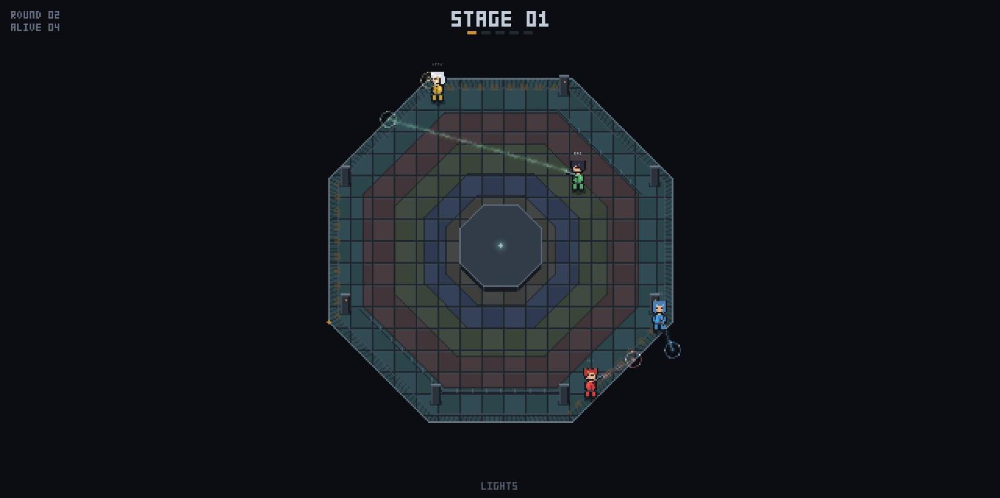
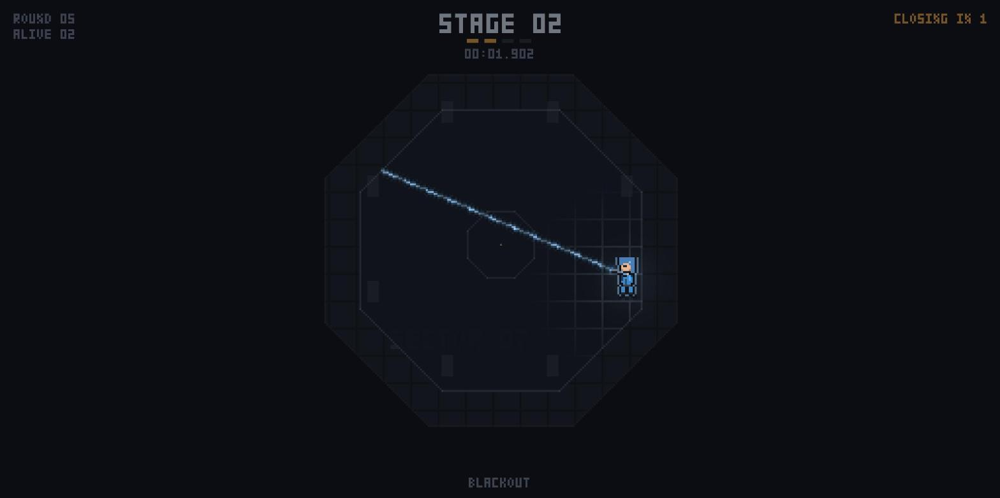

# DeadLight

A small multiplayer arena game played in the dark.

The lights come on and you see everyone. Then they go out, and for a few seconds
you can only see yourself and your own laser. Everyone moves blind, aiming at
where they think someone else went. When the lights return, every beam fires at
once.

**Play it:** [deadlight.onrender.com](https://deadlight.onrender.com) — create a
party, send the four-letter code to your friends, ready up.



## How to play

- Pick one of six fighters in the lobby. Each colour can only be taken by one player.
- **WASD** to move, **mouse** to aim. On a phone, your left thumb is a joystick
  and touching the right half aims. You can only move while the lights are off.
- A laser hits **every** player it crosses.
- If two players hit each other, both shots cancel and both survive.
- The arena shrinks through five stages as players die, or by itself if nobody
  dies for three rounds. The coloured floor bands show where it will close next.
- Last one standing wins.



## Running locally

```sh
npm install
npm run dev        # client on :5173, server on :8080
```

Production build, served from one process:

```sh
npm run build
npm start
```

`render.yaml` deploys it to Render as a single web service.

## How it works

- **TypeScript** everywhere. A Node server using `ws`, a Canvas 2D client, and a
  `shared/` folder for the rules both sides use.
- **The server is authoritative.** It moves every player and resolves each round
  from a single snapshot taken the moment the lights come back.
- **No wallhacks by design.** During a blackout a living player is only ever
  sent their own position, so there is nothing about opponents to read.
- **Pixel art without assets.** The game draws into its own pixel buffer and
  scales it up, so everything stays sharp. Characters and the HUD font are
  written as text grids in the code — no image files.

## Tests

```sh
npm test
```

Covers hit detection, movement, arena geometry, stage progression, latency
handling, and a full match run through the server.
